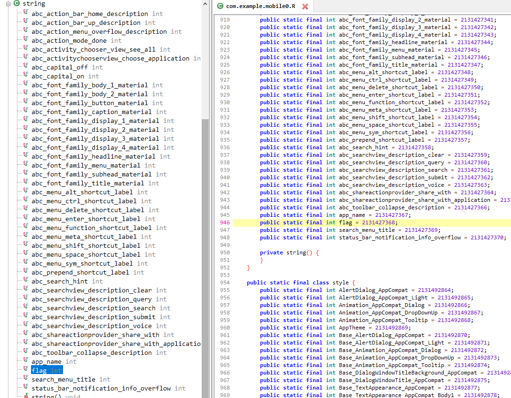

# mobile0
> xikhud, 05/04/2020.

## Problem
This is an apk file.
When we install and open the application, there is nothing, just a blank screen and a static text in the middle "Hello world !".
Then we use [jadx](https://github.com/skylot/jadx) to decompile the apk file, there is nothing much in the source code, but I found the string name `flag` in the resources file.


## Solution
If the apk file contains the string, we will use `strings` to extract it.
```bash
(env) osboxes@osboxes:~/Desktop$ strings mobile0.apk | grep auctf
auctf{m0b1le_r3v3rs1ng!!}
```
The flag is `auctf{m0b1le_r3v3rs1ng!!}`.